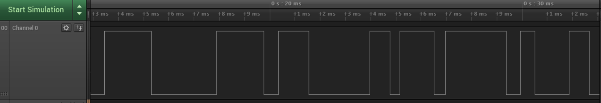
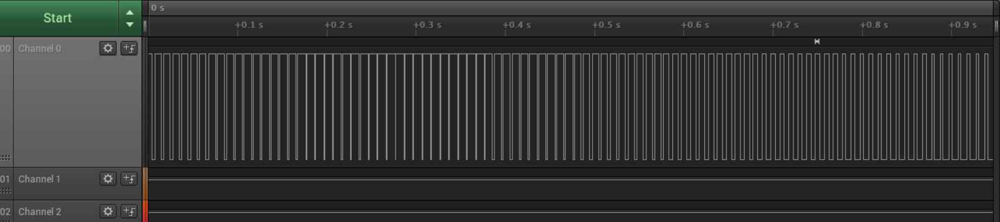

Name: Amanda Vuong

EID: axv72

Team Number:

## Questions

1. Why does your program need a setup and a loop?

    You need a setup and loop because you do not want to initialize more than once, however you want to run your loop constantly. 

2. What is the downside to putting all your code in a loop? 

    setup more than once

3. Why does your code need to be compiled?

    Compiler turns the code into machine code which the microcontroller can read

4. When lowering the frequency in procedure A, step 4, what is going wrong? Brainstorm some solutions. Dimmers exist in the real world. What is their solution?

    You can see the blinking when you reduce the frequency to below 100, so it doesn't seem that it is dimming to the naked eye. You can fix this by increasing the duty cycle if you want to keep the same low frequency.

5. Why do you need to connect the logic analyzer ground to the ESP32 ground?

    Voltage is relative. You need to ground to or the voltage would be floating

6. What is the difference between synchronous and asynchronous communication?

    Sychronous share the same clock. Asynchronous do not share the same clock.

7. Profile of UART: Sent X bytes in Y time 

    your answer here

8. Profile of SPI: Sent X bytes in Y time

    your answer here

9. Why is SPI so much faster than UART?

    your answer here

10. list one pro and one con of UART

    your answer here

11. list one pro and one con of SPI

    your answer here

12. list one pro and one con of I2C

    your answer here

13. Why does I2C need external resistors to work?

    your answer here

## Screenshots

Procedure A, step 1:

Procedure A, step 4:

Procedure B, UART:

Procedure B, SPI:

